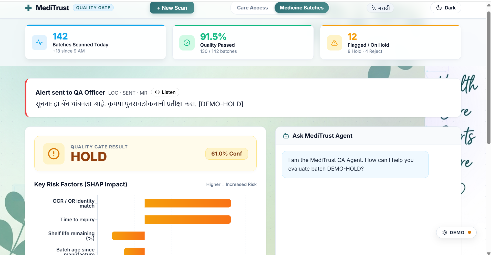
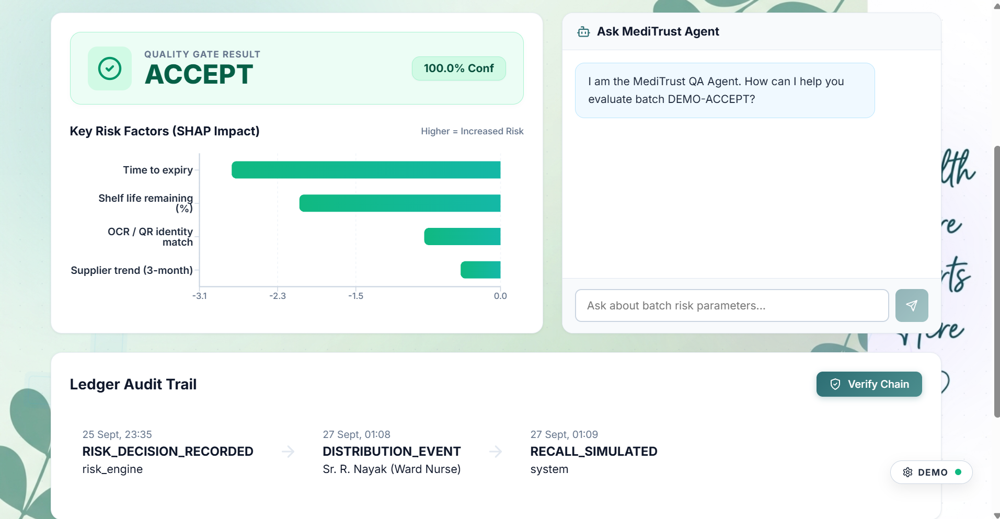
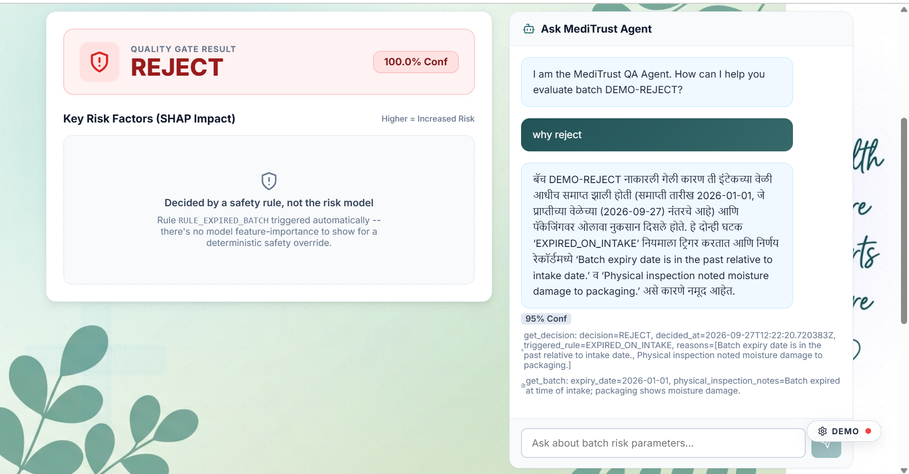
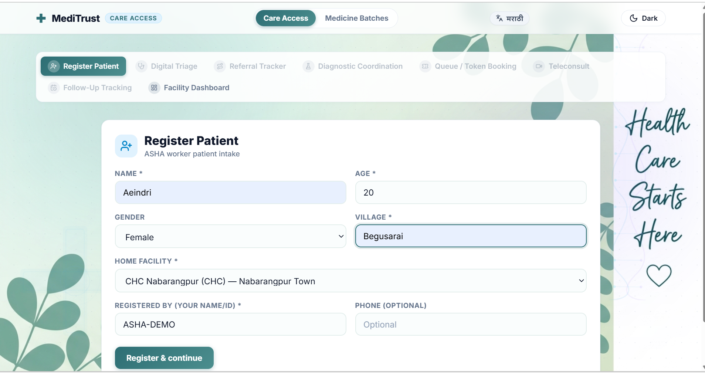
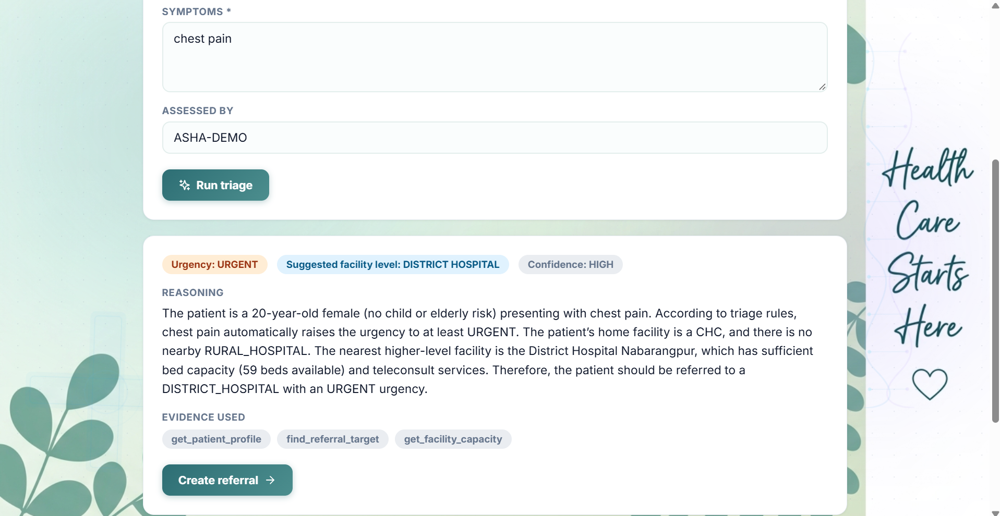
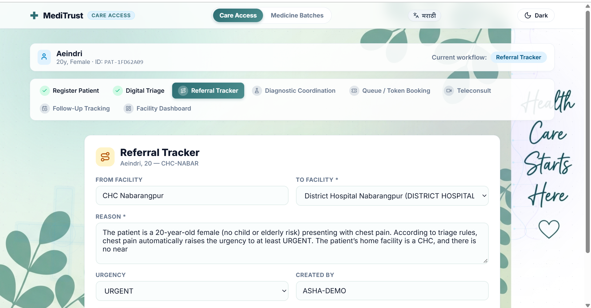

<div align="center">

# 🏥 MediTrust

**A hash-chained, explainable-AI platform for medicine supply-chain integrity and rural care access**

*Built for Smart India Hackathon*

[](https://www.python.org/)
[](https://fastapi.tiangolo.com/)
[](https://react.dev/)
[](https://www.typescriptlang.org/)
[](https://www.docker.com/)
[]()

### 🎥 [Watch the Demo Video](https://youtu.be/Kx9ljEkXP_I)

[](https://youtu.be/Kx9ljEkXP_I)

[Overview](#-overview) • [Features](#-features) • [Screenshots](#-screenshots) • [Architecture](#-architecture) • [Quick Start](#-quick-start) • [API](#-api-reference) • [Testing](#-testing)

</div>

---

## 📖 Overview

**MediTrust** is a two-in-one platform built to close two very different, equally life-critical gaps in rural and last-mile healthcare:

| | |
|---|---|
| 💊 **Medicine Batches** | An AI-powered quality gate for pharmaceutical batches moving through the supply chain — every scan, decision, distribution event, and recall is written to a **cryptographically hash-chained ledger**, with a machine-learning risk model that **explains itself** (SHAP-based feature attribution) rather than acting as a black box. |
| 🧑‍⚕️ **Care Access** | An ASHA-worker-facing workflow for patient registration, AI-assisted digital triage, referral tracking, diagnostic coordination, queue/token booking, teleconsultation, and follow-up — designed for low-connectivity, multilingual, rural front-line use. |

Both flows share one philosophy: **decisions that affect people's health should never be a black box.** Every risk score, every triage recommendation, every reject/hold/accept call is backed by a citable, auditable reason — not a bare confidence number.

---

## ✨ Features

### 💊 Medicine Batches (Quality Gate)

- **Automated risk scoring** on intake — OCR/QR identity verification, expiry tracking, shelf-life, cold-chain, supplier trend analysis
- **Explainable decisions** — every ACCEPT / HOLD / REJECT is backed by SHAP feature-importance charts *or*, for deterministic safety rules (e.g. an already-expired batch), a plain-language explanation that a rule — not a model — made the call
- **Tamper-evident ledger** — every event (risk decision, distribution, recall simulation) is appended to a hash-chained audit trail; the chain can be cryptographically **verified live** in the UI
- **One-click recall simulation** — trace every location a batch reached, deduplicated and accurate, even across repeated demo/test runs
- **Conversational QA agent** — ask natural-language questions about any batch ("why was this rejected?") and get a grounded answer citing the exact decision fields it used
- **Multilingual, spoken alerts** — QA/store-keeper alerts generated in English, Hindi, Marathi, and Odia, with text-to-speech playback
- **Live dashboard** — batches scanned today, pass rate, flagged/on-hold counts, at a glance

### 🧑‍⚕️ Care Access

- **Patient registration** — fast ASHA-worker intake tied to a home facility
- **AI digital triage** — a tool-calling agent grounds every urgency/referral recommendation in real patient and facility data (capacity, distance, risk factors) — not a guess
- **Referral tracking** — from-facility → to-facility, reasoned and timestamped
- **Diagnostic coordination, queue/token booking, teleconsultation, and follow-up tracking**
- **Facility dashboard** — bed capacity, load, and service availability across the network
- **Fully bilingual UI** (English / Marathi shown; extensible) with light/dark themes

### 🔐 Shared Trust Layer

- **FHIR export** for interoperability with external health systems
- **Idempotent APIs** — safe to retry without duplicating ledger entries or re-firing alerts
- **No raw exceptions ever reach the client** — every failure path maps to a clean, documented error
- **Dockerized** end to end for reproducible deployment

---

## 📸 Screenshots

### Medicine Batches — AI Risk Engine + Hash-Chained Ledger

<table>
<tr>
<td width="33%">

**HOLD decision with SHAP explainability**



</td>
<td width="33%">

**ACCEPT — full ledger audit trail**



</td>
<td width="33%">

**REJECT — agent explains the safety rule (in Marathi)**



</td>
</tr>
</table>

> Every decision surfaces the **exact fields** the AI agent used to answer — `decision.risk_score`, `decision.triggered_rule`, `get_batch.physical_inspection_notes` — so "why" is never a guess.

### Care Access — ASHA Worker Workflow

<table>
<tr>
<td width="33%">

**Patient registration**



</td>
<td width="33%">

**AI triage — grounded reasoning**



</td>
<td width="33%">

**Referral tracker, auto-filled from triage**



</td>
</tr>
</table>

---

## 🏗 Architecture

```
MedTrust/
├── main.py                      # FastAPI entrypoint
├── services/
│   ├── risk_engine/              # Batch risk scoring, rules, SHAP explainability
│   ├── ledger/                   # Hash-chained audit log, recall simulation, chain verification
│   ├── intake/                   # QR/OCR batch intake
│   ├── alerts/                   # Multilingual + spoken alert dispatch
│   ├── agents/                   # QA agent, supplier agent (tool-calling, grounded)
│   ├── triage/                   # Digital triage agent + tools
│   ├── patients/                 # Patient registration & longitudinal record
│   ├── referrals/                # Referral tracking
│   ├── diagnostics/               # Diagnostic coordination
│   ├── queue/                    # Token/queue booking
│   ├── teleconsult/               # Teleconsultation
│   ├── followups/                # Follow-up tracking
│   ├── facilities/                # Facility capacity & directory
│   ├── dashboard/                 # Aggregate stats
│   ├── fhir_export/               # FHIR-compatible export
│   └── ai/                       # Shared LLM completion routing
├── shared/                       # Common schemas, DB access, alert text templates
├── data/                         # Seed scripts, demo QR codes, generated alert audio
├── tests/                        # pytest suite (risk engine, ledger, agents, triage, OCR, QR, FHIR…)
└── frontend/
    ├── src/
    │   ├── components/            # DecisionScreen, AuditTrail, ChatPanel…
    │   └── components/care-access/ # Registration, Triage, Referral, Queue, Teleconsult…
    └── ...
```

**Backend:** FastAPI (Python 3.11) · SQLite (hash-chained ledger + application data) · scikit-learn / XGBoost + SHAP for risk scoring · Groq-hosted LLM for agentic reasoning · Tesseract OCR for batch intake

**Frontend:** React 18 + TypeScript · Vite · Recharts · html5-qrcode / @zxing for QR scanning

**Trust & integrity:** Every ledger write is hash-chained (`prev_hash` → `this_hash`) and independently verifiable; the risk engine's own idempotency layer prevents duplicate decisions/alerts on request replay.

---

## 🚀 Quick Start

### Option A — Docker (recommended)

```bash
git clone https://github.com/Akravorty/MedTrust.git
cd MedTrust
cp .env.example .env          # then fill in your GROQ_API_KEY
docker compose up --build
```

The backend will be available on the port configured in `docker-compose.yml`, and the frontend will build and serve alongside it.

### Option B — Run locally

**Prerequisites:** Python 3.11, Node.js 18+, [Tesseract OCR](https://github.com/tesseract-ocr/tesseract) (`apt install tesseract-ocr` on Debian/Ubuntu)

```bash
git clone https://github.com/Akravorty/MedTrust.git
cd MedTrust

# --- Backend ---
python -m venv venv
source venv/bin/activate        # Windows: venv\Scripts\activate
pip install -r requirements.txt
cp .env.example .env            # fill in GROQ_API_KEY
python main.py                  # serves the FastAPI backend

# --- Frontend (new terminal) ---
cd frontend
cp .env.example .env
npm install
npm run dev                     # serves on http://localhost:5173
```

### Environment variables

```bash
# .env  (root)
GROQ_API_KEY=your_groq_api_key_here     # powers the QA agent, supplier agent, triage agent, and /ai/complete
CORS_ORIGINS=http://localhost:5173,http://127.0.0.1:5173

# Optional per-agent model overrides
# QA_AGENT_MODEL=openai/gpt-oss-120b
# SUPPLIER_AGENT_MODEL=openai/gpt-oss-120b
# TRIAGE_AGENT_MODEL=openai/gpt-oss-120b
```

### Seeding demo data

```bash
python data/seed_recall_demo.py       # seeds DEMO-HOLD / DEMO-ACCEPT / DEMO-REJECT batches
python data/seed_realistic_batches.py # seeds a realistic day's worth of scanned batches
python data/seed_care_access.py       # seeds sample patients / facilities for Care Access
```

Demo QR codes matching the seeded batches are pre-generated in `data/demo_qr_codes/`.

---

## 🔌 API Reference

<details>
<summary><strong>Risk Engine</strong></summary>

| Method | Endpoint | Description |
|---|---|---|
| `POST` | `/risk/evaluate/{batch_id}` | Evaluate a batch and return an `ACCEPT` / `HOLD` / `REJECT` decision with SHAP-based reasoning. Supports an `Idempotency-Key` header to safely retry without duplicating the decision, alert, or ledger entry. |
| `GET` | `/risk/decisions/{batch_id}` | Fetch the stored decision for a batch. |

</details>

<details>
<summary><strong>Ledger</strong></summary>

| Method | Endpoint | Description |
|---|---|---|
| `POST` | `/ledger/log` | Append a hash-chained event. |
| `GET` | `/ledger/trace/{batch_id}` | Full ordered event history for a batch, with live chain-integrity verification. |
| `POST` | `/ledger/recall/simulate/{batch_id}` | Simulate a recall — returns every real distribution stop the batch reached, deduplicated. |

</details>

<details>
<summary><strong>Care Access</strong></summary>

| Method | Area | Description |
|---|---|---|
| `POST` / `GET` | `/patients` | Register and retrieve patients. |
| `POST` | `/triage` | Run the AI triage agent against a patient's symptoms and facility context. |
| `POST` / `GET` | `/referrals` | Create and track referrals between facilities. |
| — | `/diagnostics`, `/queue`, `/teleconsult`, `/followups`, `/facilities` | Coordination, booking, consult, and capacity endpoints for the full care-access workflow. |

</details>

<details>
<summary><strong>Other</strong></summary>

| Method | Endpoint | Description |
|---|---|---|
| `POST` | `/ai/complete` | Shared LLM completion route used by all agents and the dashboard's "explain" / "summarize" features. |
| `GET` | `/fhir/export/{...}` | Export patient/encounter data in FHIR-compatible format. |
| `GET` | `/dashboard/*` | Aggregate stats — batches scanned, pass rate, flagged counts. |

</details>

Full interactive documentation is available at `/docs` (FastAPI's built-in Swagger UI) once the backend is running.

---

## 🧪 Testing

```bash
python -m pytest -v
```

The suite covers the risk engine, hash-chained ledger integrity, recall simulation, OCR/QR intake, image validation, the QA/supplier/triage agents, multilingual alerts, FHIR export, and facility geo-matching — 20+ test files, run continuously through development.

```bash
# Frontend
cd frontend
npm run build     # type-checks with tsc, then builds
npm test          # vitest
```

---

## 🎯 Why MediTrust

Rural and last-mile healthcare fails in two quiet, related ways: **medicine that shouldn't reach a patient does**, and **a patient who needs urgent care doesn't get routed there fast enough.** MediTrust treats both as the same underlying problem — a lack of trustworthy, explainable, auditable decision-making at the point where it matters most — and solves both with the same design principles: ground every AI decision in real data, explain every call in plain language, and make every action tamper-evidently auditable.

---

<div align="center">

Built with ❤️ for Smart India Hackathon

</div>
